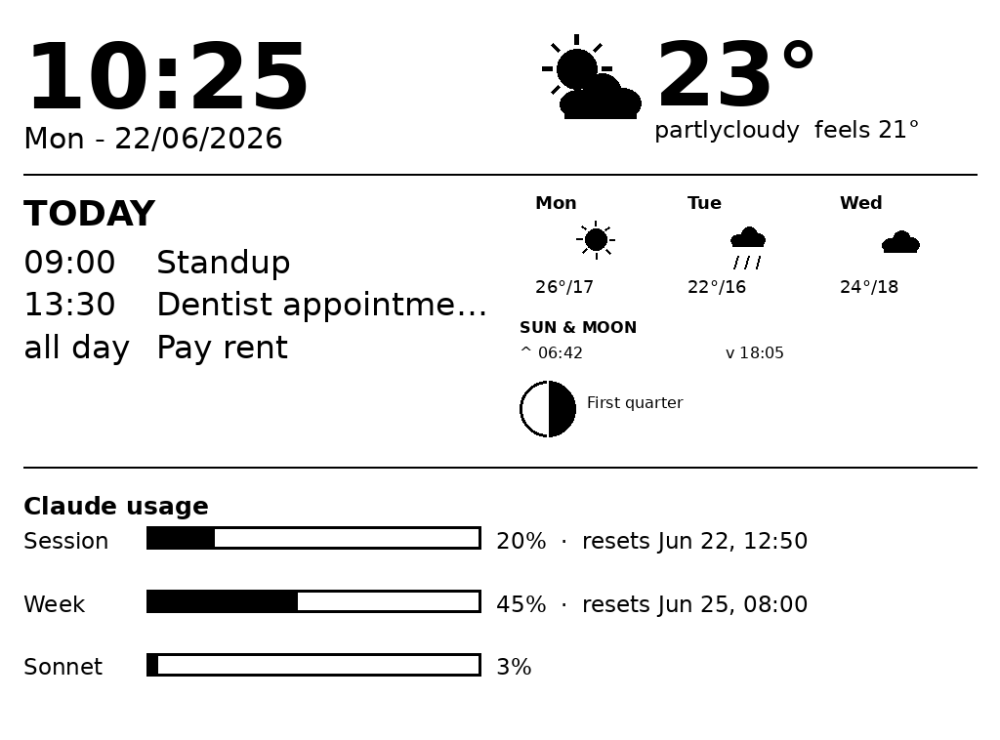

# kindle-dash

Turn a dead/old jailbroken Kindle into a calm, glare-free **e-ink wall dashboard** — clock, weather, a 3-day forecast, today's agenda, sun & moon, and your live **AI subscription usage** (Claude · Codex · opencode) — rendered server-side and painted by the device on a timer.

> *Your Kindle didn't die. It ascended into furniture.*

No glowing rectangle, no app, no cloud account. A tiny container renders a grayscale PNG; the Kindle just fetches and paints it. It looks like a framed print, draws milliwatts, and is readable in direct sun.

<p align="center">
  
</p>

## What it shows

- **Clock + date** — big, 24-hour, minute-aligned so it never drifts.
- **Weather now** — temperature, condition, "feels like", drawn icon (no icon fonts to ship).
- **Forecast** — next N days (hi/lo + icon).
- **Agenda** — today's calendar events.
- **Sun & moon** — sunrise/sunset + a computed moon-phase glyph.
- **AI usage** — live subscription limits side by side: Claude (5h/7d/Extra), Codex (available windows/Credits), opencode Go (5h/Week/Month). Columns size themselves to however many you enable.

Every panel is optional. A panel with no data source configured just renders a quiet placeholder — never a broken image.

## Why it exists

A 6-inch e-ink screen is the *perfect* ambient display: paper-like, sunlight-readable, and it sips power only when the image changes. Old Paperwhites go for ~$20 and are almost always old enough to jailbreak. The catch is that the device is ancient — its TLS can't do modern HTTPS and it has no real runtime. So instead of asking the Kindle to *do* anything, kindle-dash does all the work elsewhere and hands the device a finished picture. The Kindle's only job is `curl | eips`.

## How it works

```
  ┌──────────── any always-on host the Kindle can reach (LAN) ───────────┐
  │  kindle-dash renderer (container, Python + Pillow)                   │
  │    • lays out a grid of WIDGETS, draws a grayscale PNG               │
  │    • pulls: Home Assistant (weather/forecast/sun/agenda)             │
  │            Claude/Codex usage API + opencode dashboard scrape        │
  │    • serves GET /dash.png  (plain HTTP — the Kindle can't do TLS)    │
  └───────────────────────────────┬──────────────────────────────────────┘
                                   │  http (LAN)
                ┌──────────────────▼───────────────────┐
                │  Kindle (jailbroken)                  │
                │   dashboard.sh: every minute,         │
                │   curl /dash.png?rotate=90 | eips     │
                │   KUAL menu: Start / Stop             │
                └───────────────────────────────────────┘
```

**Where it runs:** the renderer is just a container — put it on any always-on machine the Kindle can reach over your LAN. The device must be able to fetch it over **plain HTTP** (no TLS), so keep it local. You point the Kindle at it with a single variable, **`DASH_URL`**.

The renderer is **slot-based**: `render()` lays out boxes and hands each to a widget (`fetch()` + `draw(d, box)`). Adding a panel is a small function — see [WIDGETS.md](WIDGETS.md).

## Quick start

Use the published image (built by CI, amd64):

```bash
cp .env.example .env && $EDITOR .env                        # set resolution + sources
docker run -d --name kindle-dash -p 8810:8080 --env-file .env \
  -v kindle_dash_data:/data ghcr.io/erikbpf/kindle-dash:0.1.0   # serves :8810/dash.png
```

Or build from source:

```bash
git clone https://github.com/ErikBPF/kindle-dash && cd kindle-dash
cp .env.example renderer/.env && $EDITOR renderer/.env      # set resolution + sources
cd renderer && docker compose up -d --build                # serves :8810/dash.png
```

Then set up the device (jailbreak, `dashboard.sh`, KUAL Start/Stop). Full walkthrough: **[INSTALLATION.md](INSTALLATION.md)**.

## Docs

| | |
|---|---|
| [INSTALLATION.md](INSTALLATION.md) | renderer + Kindle + reverse-proxy, step by step |
| [CONFIGURATION.md](CONFIGURATION.md) | every env var, data sources, resolution/rotation |
| [USAGE.md](USAGE.md) | Start/Stop, refresh cadence, troubleshooting |
| [WIDGETS.md](WIDGETS.md) | the roadmap + how to add your own widget |
| [SECURITY.md](SECURITY.md) | usage-panel credential caveats — Claude/Codex tokens, opencode cookie (read before enabling) |
| [CONTRIBUTING.md](CONTRIBUTING.md) | dev shell (devenv), conventions |

## A word on the usage panels

All three lean on **unofficial** plumbing — they're opt-in and disappear when unconfigured:

- **Claude & Codex** call undocumented OAuth usage endpoints with a token the renderer refreshes itself. Give the dashboard its **own** login for each (not your laptop's) — refresh tokens rotate, and sharing one lineage eventually logs the other out.
- **opencode** has **no usage API at all**, so that panel scrapes the Go dashboard HTML with a browser session cookie. The cookie expires every few days with no refresh path — re-grab it with `tools/opencode-capture.py` when the panel goes `(stale)`.

The whole story (and how to seed each safely) is in [SECURITY.md](SECURITY.md).

## License & contributing

MIT — see [LICENSE](LICENSE). Issues and PRs welcome; [CONTRIBUTING.md](CONTRIBUTING.md) has the dev setup (`devenv` + `direnv`, one `preview` command to render a frame locally).
